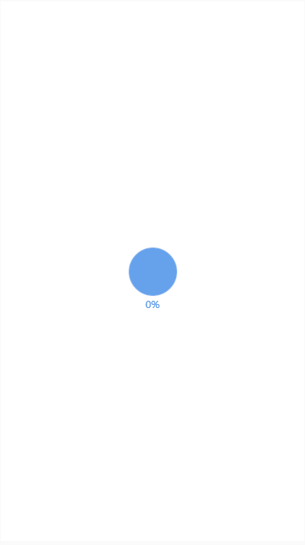

### 概述
运用 HTML5，CSS3，JS，采用组件式开发模式，使用面向对象编程思想，开发 Web App 全站，实现不同类型的 HTML5 动态数据报告。

### 效果预览

### 主要功能
1. 首页载入动画
2. 滑动切换页面
3. 9个内容页面。封页；核心理念（图文）；课程分布（折线图）；移动课程（饼图）；前端课程（柱状图）；后端课程（雷达图）；报名过万（环状图）；难度分布（散点图）；尾页。

### 技术栈
jQuery + fullpage.js + Canvas

### 内容组织方式 
page --- component 每一个页面对应一个 page, page 中的每一个组件对应一个 component 

柱状图和垂直柱状图使用 html + css 来实现
折线图、雷达图、饼图、环状图使用 canvas 来实现

### 开发流程
1. 设计稿标注 & 切图
2. 编写静态页面
   +  验证 fullpage.js 插件的页面切换功能
   +  利用 fullpage.js 事件，实现组件 “入场，出场” 动画
3. 实现公用图文组件 PublicComponent； 实现 “出场 入场” 动画提取
4. 实现一个 “内容组织的” 类，命令为 App
    App 类实现组织 page 和 component 的功能 方便任意添加 page / component
5. 图表组件 ComponentBar ComponentPolyline ComponentRadar ComponentPie ComponentRing ...
6. 应用初始 loading 功能
7. 组件、功能整合
